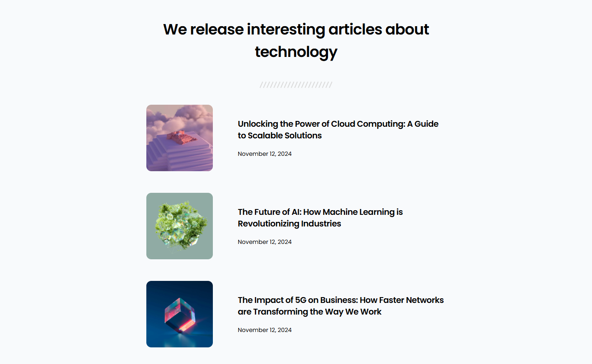

<h1 align="center">Simple Article Listing | devChallenges</h1>

   Solution for a challenge <a href="https://devchallenges.io/challenge/simple-article-listing" target="_blank">Simple Article Listing</a> from <a href="http://devchallenges.io" target="_blank">devChallenges.io</a>.

  <h3>
    <a href="https://st0272.github.io/dc-simple-article-listing/">
      Demo
    </a>
     | 
    <a href="https://github.com/st0272/dc-simple-article-listing">
      Solution
    </a>
     | 
    <a href="https://devchallenges.io/challenge/simple-article-listing">
      Challenge
    </a>
  </h3>

<!-- TABLE OF CONTENTS -->

## Table of Contents

- [Table of Contents](#table-of-contents)
- [Overview](#overview)
  - [Built with](#built-with)
- [Author](#author)

<!-- OVERVIEW -->

## Overview

Desktop  

Tablet  

Mobile (640px)  

### Built with

- Semantic HTML5 markup
- CSS custom properties
- Flexbox
- CSS Grid
- [Tailwind](https://tailwindcss.com/)
- Google Fonts

## Author

- Website [Suzunatsu Web](https://www.suzunatsu.com)
- GitHub [@st0272](//github.io/st0272/)
